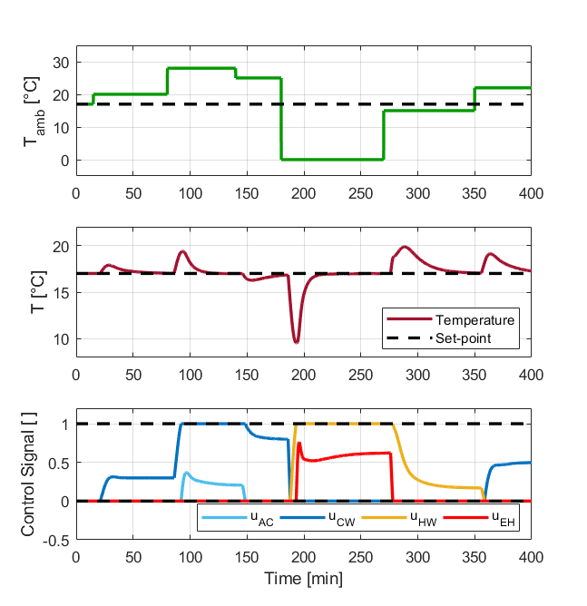
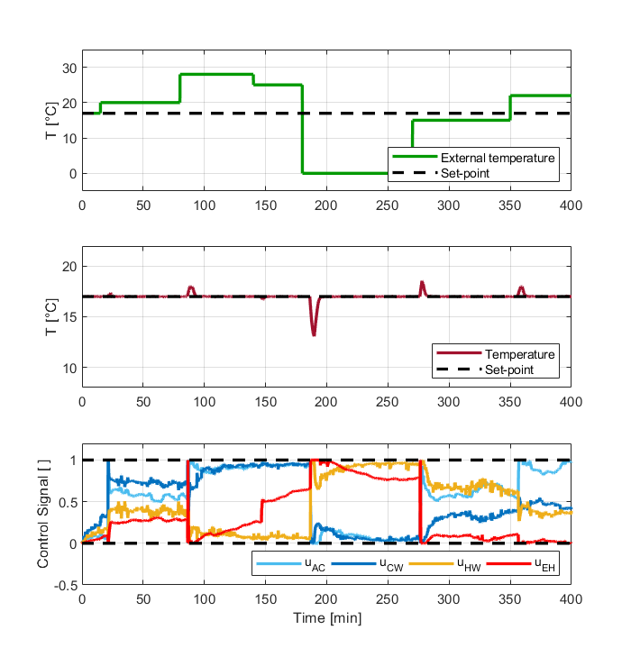
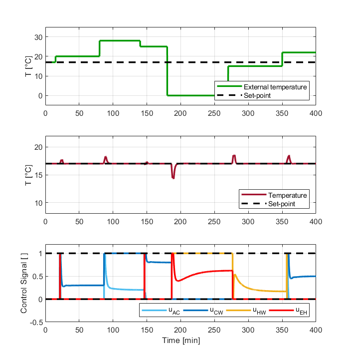
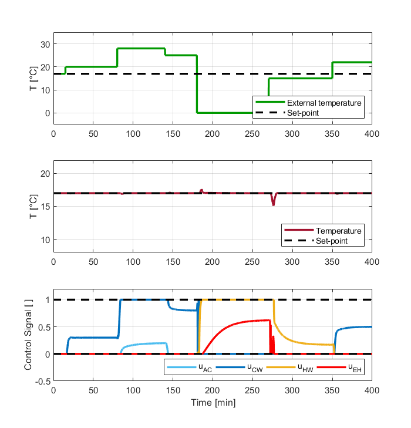

# Supplementary material for the paper "A model predictive control interpretation of the generalized split-range control"

The following supplementary material accompanies the paper titled "A Model Predictive Control Interpretation of the Generalized Split-Range Control," authored by José Diogo Forte de Oliveira Luna, Rafael Oliveira Pedrisch, João Victor Bezerra da Silva, José Souto Guimarães Ferreira Júnior, Carlos Henrique Azevedo Guimarães, Kariston Dias Alves, and Julio Elias Normey-Rico.

This material includes a detailed formulation of the Generalized Predictive Control (GPC) used for comparison, as well as an expanded formulation of the Split-Range Generalized Predictive Control (SRGPC), which is presented in a shorter manner in the paper. Additionally, the time response curves for both the GPC and SRGPC with feedforward action are also provided, as these were omitted from the main document due to page limitations. An additional example of the formulation is also included, with particular emphasis on the matrix representation of the Mixed-Integer Quadratic Programming (MIQP) problem.

# GPC Formulation

The QP problem solved at each sample to obtain the optimal control sequence and apply the first increment to the system is shown below:

$$
\begin{aligned}
\min \quad & \sum_{j=N_1}^{N_2} \gamma(w(k+j) - \hat{y}(k+j))^2 +  \sum_{i=1}^{4}  \sum_{j=0}^{N_u-1}  \lambda_i(\Delta u_i(k+j))^2\\
\textrm{s.a.} \quad & 0 \leq \sum^{j}_{i=0} \Delta u_1(k+i) + u_1(k-1) \leq 1\\
\quad & 0 \leq \sum^{j}\_{i=0} \Delta u_2(k+i) + u_2(k-1) \leq 1\\
\quad & 0 \leq \sum^{j}\_{i=0} \Delta u_3(k+i) + u_3(k-1) \leq 1\\
\quad & 0 \leq \sum^{j}\_{i=0} \Delta u_4(k+i) + u_4(k-1) \leq 1\\
\quad & \forall j \in [0 , N_u-1]
\end{aligned}
$$

which is the classical formulation for the GPC controller. As that is, there is no incentive for the controller to avoid using the more expansive inputs except for the $\lambda_i$ values.

$N_1$ and $N_2$ are the limits of the prediction horizon, $N_u$ is the size of the control horizon, $w(k+j)$ is the reference trajectory, $\hat{y}(k+j)$ is the predicted output, $\Delta u_i$ is is the control increment for the i-th input and $\gamma$ and $\lambda_i$ are the weights for the error and control effort terms of the cost function. This objective function can be understood as a trade-off between eliminating the error quickly and having a smooth control action. If $\gamma$ is increased the importance of the error term becomes greater and the controller will use the inputs more aggressively to curb the error down. Conversely, if the $\lambda_i$ values are increased, the controller will use the inputs more parsimoniously, leading to smoother control effort but longer lasting error.

# SRGPC Formulation

The MIQP problem solved at each sample to obtain the optimal control sequence and apply the first increment to the system is shown below:

$$
\begin{aligned}
\min \quad & \sum_{j=N_1}^{N_2} \gamma(w(k+j) - \hat{y}(k+j))^2 +  \sum_{i=1}^{4}  \sum_{j=0}^{N_u-1}  \lambda_i(\Delta u_i(k+j))^2\\
\textrm{s.a.} \quad & 0 \leq \sum^{j}_{i=0} \Delta u_1(k+i) + u_1(k-1) \leq 1 - \delta_1(k+j)\\
\quad & 1 - \delta_1(k+j) \leq \sum^{j}\_{i=0} \Delta u_2(k+i) + u_2(k-1) \leq 1 - \delta_2(k+j)\\
\quad & \sigma_3(k+j) \leq \sum^{j}\_{i=0} \Delta u_3(k+i) + u_3(k-1) \leq \delta_2(k+j)\\
\quad & 0 \leq \sum^{j}\_{i=0} \Delta u_4(k+i) + u_4(k-1) \leq \sigma_3(k+j)\\
\quad & \forall j \in [0 , N_u-1]
\end{aligned}
$$

Additional constraints could also be added, like limits on the control increments or limits on the output variable.

# Additional Results

  
Response for the GSRC

  

  
Response for the GPC

  

  
Response for the SRGPC

  

  
Response for the SRGPC+FF

  

# Additional Exemple

To demonstrate the use of the proposed formulation with actuator sequencing, analogous to a split-range control, a process with the following dynamics was simulated:

$$    Y(z^{-1}) = \dfrac{z^{-1}}{1-0.5z^{-1}} \left( 0.2 U_1(z^{-1}) + 0.15 U_2(z^{-1}) +0.15 U_3(z^{-1}) \right)$$

where $Y(z^{-1})$ is the process variable and $U_i(z^{-1})$ is the i-th manipulated variable, with the latter already ordered from cheapest to most expensive, $z^{-1}$ being the discrete delay operator and the plant being sampled with a period of $T_s = 0.1$ seconds.

To assemble the MIQP problem, the decision variables are stacked in a vector:

$$ X = \left[
\begin{array}{c}
\Delta U_1 \\\
\Delta U_2 \\\
\Delta U_3 \\\
\delta_1 \\
\delta_2 \\
\end{array}
\right],$$

where each $\Delta U_i$ is itself a vector containing the control increments at horizon $\Delta u_i(k), ... , \Delta u_i (k+N_u-1)$, where $N_u$ is the size of the control horizon, and $\delta_i$ is a vector containing the binary variables in the horizon $\delta_i(k), ..., \delta_i (k+N_u-1)$, you can write the MIQP constraints in the form:

   $$ A_{nq} X \leq b_{nq},$$

where: 

$$
    A_{nq} = \begin{bmatrix}
T & 0 & 0 & 0 & 0 \\\
-T & 0 & 0 & I & 0 \\\
0 & T & 0 & -I & 0 \\\
0 & -T & 0 & 0 & I \\\
0 & 0 & T & 0 & -I \\\
0 & 0 & -T & 0 & 0 \\\
\end{bmatrix}, 
$$

where $T$ is a unit lower triangular block of dimension $N_u \times N_u$, and: 

$$ b_{nq} = \begin{bmatrix} (1-u_1(k-1)) U \\\ u_1(k-1) U \\\ -u_2(k-1) U \\\ u_2(k-1) U \\\ -u_3(k-1) U \\\ u_3(k-1) U \\ \end{bmatrix},$$

where $U$ is a vector filled with ones of length $N_u$.

Additionally, the objective function will be written as:

$$
    J = \dfrac{1}{2} X^T H_o X + q_o^T X,
$$

where:

$$
   H_o = \begin{bmatrix}
2(G^T Q_\gamma G + Q_\lambda) & 0 \\\
0 & 0
\end{bmatrix}, 
$$

where $Q_\gamma$ is the diagonal matrix with the weighting in the quadratic error and $Q_\lambda$ is the diagonal matrix containing the weightings for the control effort of each input, also with the $0$ of appropriate dimensions for the number of binary variables of $X$ and:

$$
   q_o = \begin{bmatrix}
(2(f-W)^T Q_\gamma G)^T \\\ 0
\end{bmatrix}, 
$$

with the $0$ dimension appropriate for the number of binary variables in the final lines of $X$.

Thus, the problem to be solved at each instant of time to calculate the optimal control increment to be applied to the process is:

$$
\begin{aligned}
\min \quad & \dfrac{1}{2} X^T H_o X + q_o^T X\\
\textrm{s.a.} \quad & A_{nq} X \leq b_{nq}\\
\end{aligned}
$$

